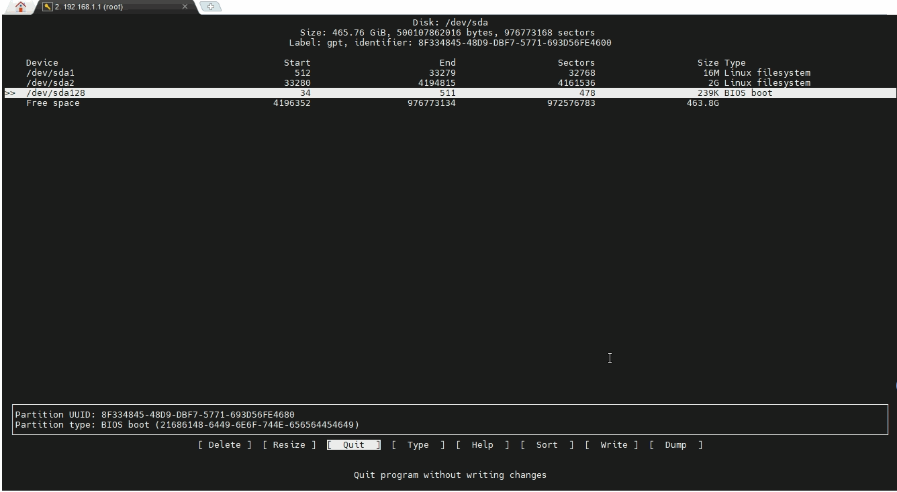

import Tabs from '@theme/Tabs';
import TabItem from '@theme/TabItem';

## 安装软路由
可以参照安装与部署

## 扩容
通过镜像安装软路由后，会发现挂载的卷并不是自己硬盘容量，因为在镜像安装完成后，第一次启动就默认初始化了磁盘，其大小几乎与镜像文件大小一致。导致我们磁盘还有很大空间没有利用，而且当我们要安装软件或者docker时，默认容量一下就爆满，所以扩容对真正玩转软路由是必备技能。

### 创建新卷
进入软路由控制台，ssh/putty都可以，安装cfdisk

~~~shell
opkg update
opkg install cfdisk
cfdisk		# 进入磁盘管理，移动光标创建新卷，保存退出
~~~

### 挂载到overlay

进入路由后台，在系统/挂载卷中添加挂载卷，将新建卷挂载到/overlay

## 保存重启

docker中可以查看到卷成功扩容